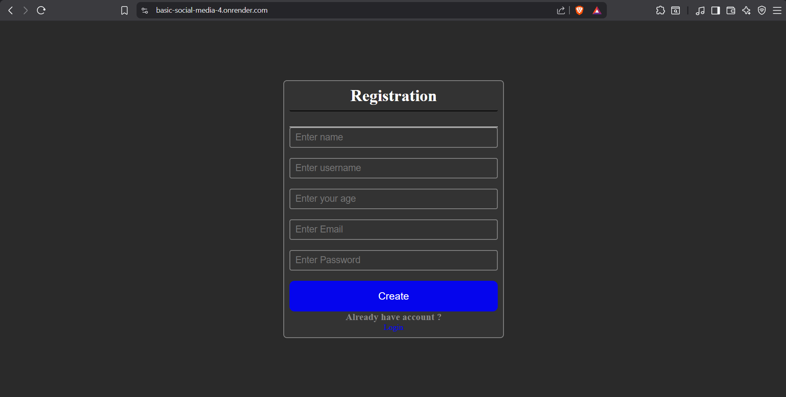
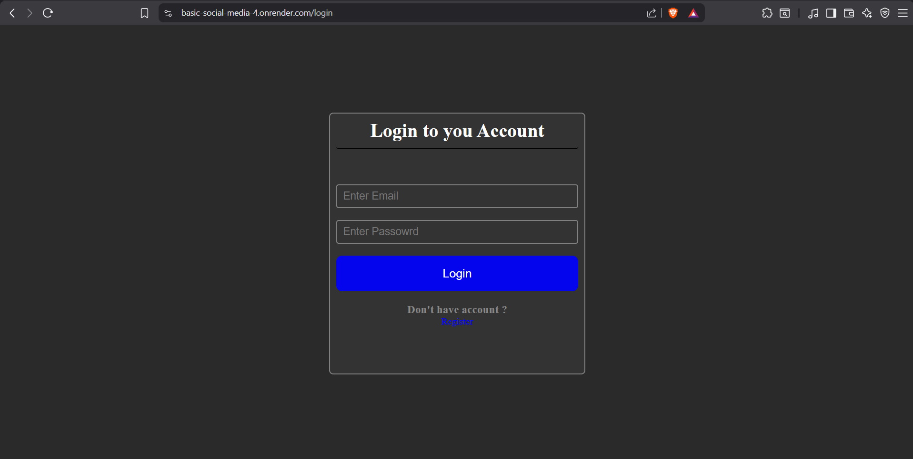
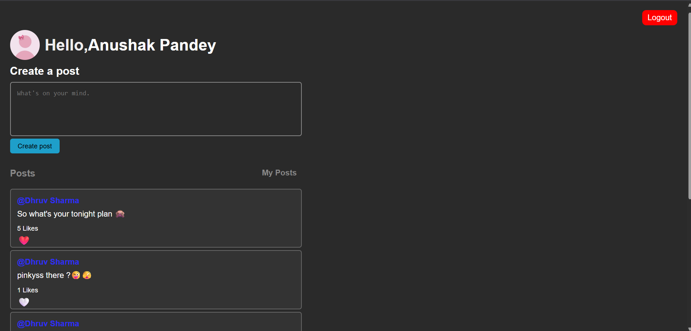

# 🌐 Basic Social Media Web App

<p align="center">


</p>

<p align="center">
A full-stack social media web application built using <strong>Node.js</strong>, <strong>Express.js</strong>, <strong>MongoDB</strong>, and <strong>EJS</strong>. This project helped me learn authentication, CRUD operations, middleware, database relationships, and deploying a complete backend application.
</p>

---

# 🚀 Live Demo

🌍 **Live Website**

**https://basic-social-media-4.onrender.com**
<p>
  <a href="https://basic-social-media-4.onrender.com">
    
  </a>
</p>

---

# 📸 Project Screenshots

## Register Page

<p align="center">

</p>

---

## Login Page

<p align="center">

</p>

---

## Profile Dashboard

<p align="center">

</p>

---

## Edit Post

<p align="center">

</p>

---

# ✨ Features

### 👤 User Authentication

- User Registration
- Secure Login
- Logout
- Password Hashing using bcrypt
- JWT Authentication
- Cookie-based Authentication
- Protected Routes

---

### 📝 Post Management

- Create New Post
- Edit Existing Post
- Like / Unlike Posts
- View All Personal Posts

---

### ⚙ Backend Features

- RESTful Routing
- CRUD Operations
- Express Middleware
- JWT Verification
- MongoDB Relationships
- Mongoose Population
- Server-side Rendering with EJS
- Error Handling

---

# 🛠 Tech Stack

## Frontend

- HTML5
- CSS3
- JavaScript
- EJS

## Backend

- Node.js
- Express.js

## Database

- MongoDB Atlas
- Mongoose

## Authentication

- JWT (JSON Web Token)
- bcrypt
- Cookie Parser

## Deployment

- Render
- GitHub

---

# 📂 Project Structure

```text
Basic-Social-Media
│
├── models
│   ├── user.js
│   └── post.js
│
├── public
│   ├── images
│   ├── stylesheet
│   └── javascript
│
├── screenshots
│   ├── register.png
│   ├── login.png
│   ├── profile.png
│   └── edit-post.png
│
├── views
│   ├── register.ejs
│   ├── login.ejs
│   ├── profile.ejs
│   └── edit.ejs
│
├── app.js
├── package.json
├── package-lock.json
└── README.md
```

---

# ⚙ Installation

### 1. Clone the Repository

```bash
git clone https://github.com/YOUR_USERNAME/Basic-Social-Media.git
```

### 2. Move into the Project

```bash
cd Basic-Social-Media
```

### 3. Install Dependencies

```bash
npm install
```

### 4. Create a `.env` File

```env
PORT=3000

MONGO_URI=YOUR_MONGODB_ATLAS_CONNECTION_STRING

JWT_SECRET=YOUR_SECRET_KEY
```

### 5. Start the Application

```bash
npm start
```

Open your browser and visit

```
http://localhost:3000
```

---

# 🧠 What I Learned

Through this project, I gained practical experience with:

- Express.js Routing
- CRUD Operations
- MongoDB & Mongoose
- Schema Design
- Authentication with JWT
- Password Hashing using bcrypt
- Cookie-based Authentication
- Express Middleware
- Protected Routes
- MongoDB Population
- EJS Template Engine
- Error Handling
- Git & GitHub Workflow
- Deployment on Render

---

# 📦 Dependencies

- express
- mongoose
- ejs
- bcrypt
- jsonwebtoken
- cookie-parser
- multer
- dotenv

---

# 🚀 Future Improvements

- Upload Profile Picture
- Delete Posts
- Comments on Posts
- Follow / Unfollow Users
- User Search
- Notifications
- Forgot Password
- Email Verification
- Dark / Light Theme
- Fully Responsive UI
- Infinite Scrolling
- Real-time Chat
- Image Uploads

---

# 🎯 Learning Objectives

✔ Build a complete backend application

✔ Understand authentication using JWT

✔ Learn CRUD operations

✔ Work with MongoDB relationships

✔ Practice Express middleware

✔ Deploy a Node.js application

---

# 🤝 Contributing

Contributions are welcome!

1. Fork the repository

2. Create a new branch

```bash
git checkout -b feature-name
```

3. Commit your changes

```bash
git commit -m "Added new feature"
```

4. Push to GitHub

```bash
git push origin feature-name
```

5. Open a Pull Request

---

# 📄 License

This project is licensed under the **MIT License**.

---

# 👨‍💻 Author

### Aniket Sharma

🔗 GitHub

https://github.com/Aniket-MCA

🔗 LinkedIn

www.linkedin.com/in/aniket-sharma-0576b8339

---

# ⭐ Support

If you found this project helpful, consider giving it a **⭐ Star** on GitHub.

It encourages me to build more projects and continue learning Full Stack Development.

---

<p align="center">
Made with ❤️ using Node.js, Express.js, MongoDB & EJS
</p>
